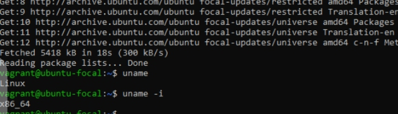
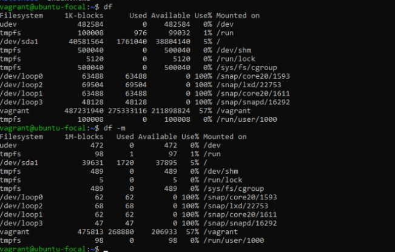
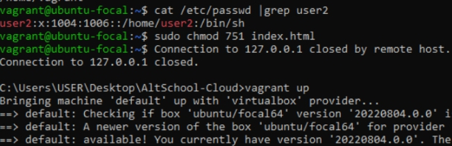
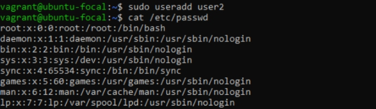
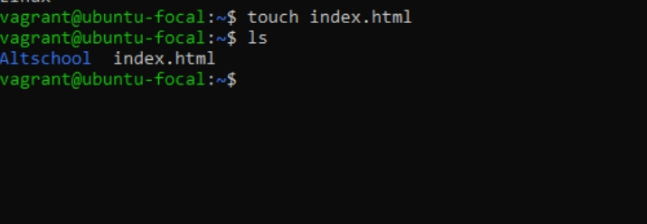
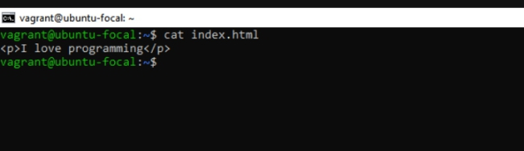
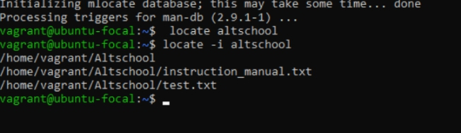
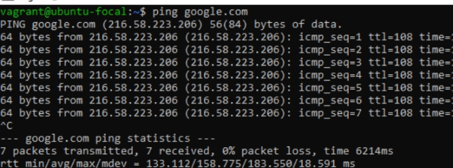
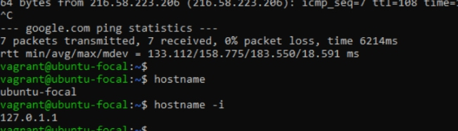
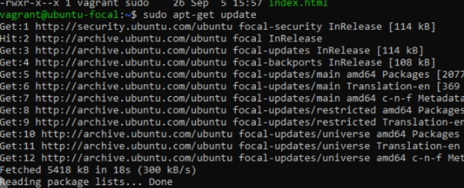

# ALTSchool Cloud Engineering Exercise-2

### Research online for 10 more linux commands asides the one already mentioned.

<ul> 
<li>Uname: The uname command allow you to know some basic information which comes really handy when you work on multiple systems. Using the parameter -a brings out all the info. and uname -i brings out the version installed. E.g. uname: linux  

</li>
 

<li>df: When working with Linux, the df command is a very efficient utility to mount filesystems and get details of the file system. That is it means that we’ll connect the device to a folder so we can access the files from our filesystem. df will output in kb and df -m to output in mb or df -h 

</li>

<li>chmod: The chmod command give us the functionality to change file permissions. chmod "parameter" filename. This can only be done by a root user. 

</li>

<li>sudo: This command is equivalent to having logged in as root (based on what permissions you have as a sudoer).
Just add the word sudo before any command that you need to run with escalated privileges and that’s it. sudo "permission" filename  

</li>

<li>touch: The touch command is used to create empty files. We can create multiple empty files by executing it once. E.g.touch 'filename'.  

</li>

<li>cat: The cat command is a multi-purpose utility in the Linux system. It can be used to create a file, display content of the file, copy the content of one file to another file and more. cat 'filename' to show contents   

</li>

<li>locate: The locate command is used to search a file by file name. It is a background process. It searches the file in the database. To find the file with the locates command, keep your database updated. locate 'filename' or locate -i 'filename' to ignore the case.  

</li>

<li>ping: The ping command is used to check the connectivity between two nodes, that is whether the server is connected. It is a short form of "Packet Internet Groper". e.g. ping 'server'.  

</li>

<li>hostname: hostname command in Linux is used to obtain the DNS(Domain Name System) name and set the system's hostname or NIS(Network Information System) domain name. e.g. hostname "displays the systems's hostname", hostname -i "displays system ip".  

</li>

<li>apt-get: On Linux operating systems that use the APT package management system, the apt-get command is used to install, remove, and perform other operations on installed software packages. This can only be used by a root user or user granted the privileges. apt-get 'parameter'

</li>
</ul>