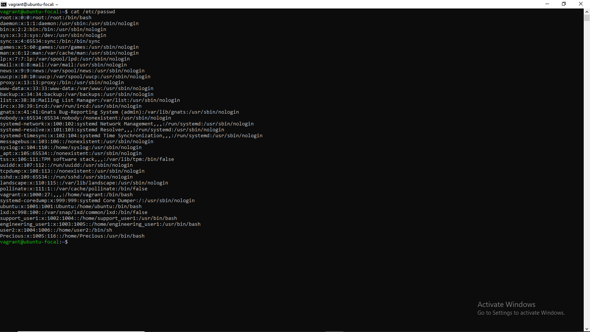
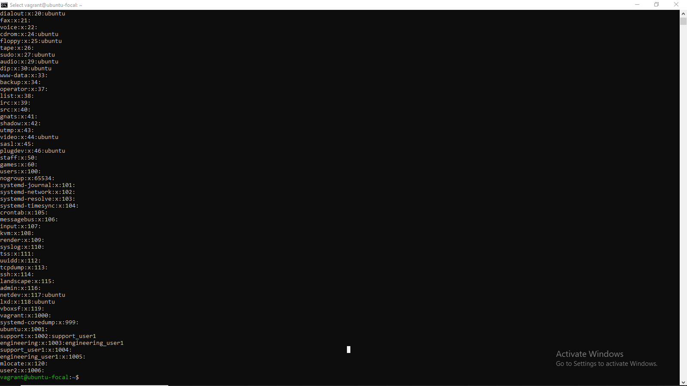
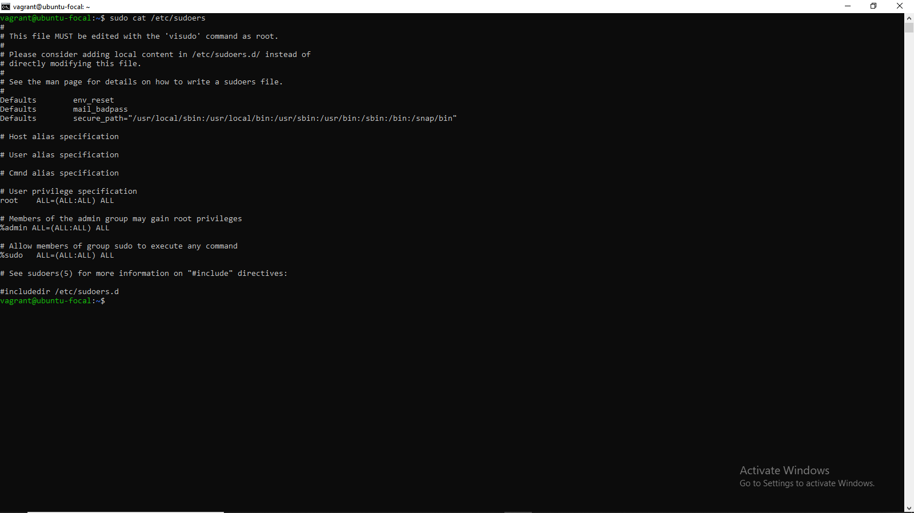

# Contents of /etc/passwd, /etc/group, /etc/sudoers

  
  

<ul>
<li>Created 3 groups of admin, support and engineering and added admin to sudoers</li>
<li>Generated a user in each of the group</li>
<li>Generated ssh keys for the user in the admin group</li>
</ul>